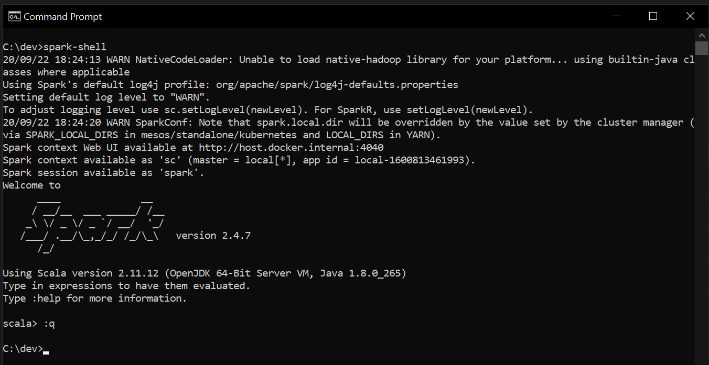

### How to setup Spark 2.4 on your Windows 10 machine without admin access ###

1. Install git-bash

    Go to https://git-scm.com/download then click on Windows. It will take you to https://git-scm.com/download/win and download will start automatically. If not, choose 64-bit **Git for Windows Setup**.

    **git-bash** itself is not necessary to run Spark. In this setup spark-shell will be invoked in Windows CMD. But I have added this part since I will be using `unzip` command provided by git-bash install and other commands to do other stuff that can be done in Windows UI or CMD.

2. Create a directory where you would place all software needed by Spark.

    Open git-bash and issue command:
    ```
    $ mkdir -p /c/dev
    ```
    This will create a directory called dev in your C:\ drive. You can choose a different name from dev, if you like. But for this, I'm going to use `C:\dev` directory.

3. Download JDK 8 zipped binary from Amazon and unzip to C:\dev. 

    Use this link https://corretto.aws/downloads/latest/amazon-corretto-8-x64-windows-jdk.zip.
    Or you go to the download page https://docs.aws.amazon.com/corretto/latest/corretto-8-ug/downloads-list.html and choose the download link for the zip file.

    To do a checksum on the file, do this in git-bash.
    ```
    $ CertUtil -hashfile <downloaded zip file> MD5
    ```

    Unzip the file into C:\dev directory in git-bash.
    ```
    $ unzip ~/Downloads/amazon-corretto-8.265.01.1-windows-x64-jdk.zip -d /c/dev
    ```

4. Download Scala 2.12 zipped binary and unzip to C:\dev. 

    Go here https://www.scala-lang.org/download/2.12.12.html and download the Windows zip file. Or go here https://downloads.lightbend.com/scala/2.12.12/scala-2.12.12.zip to download it directly.

    Unzip the file into C:\dev directory in git-bash.
    ```
    $ unzip ~/Downloads/scala-2.12.12.zip -d /c/dev
    ```

5. Download Spark 2.4.7 and extract to C:\dev.

    Go to https://spark.apache.org/downloads.html, then choose Spark release 2.4.7 and package type **Pre-built for Apache Hadoop 2.7** then click on the link. Or download the file directly from here http://mirror.metrocast.net/apache/spark/spark-2.4.7/spark-2.4.7-bin-hadoop2.7.tgz.

    Untar the file into C:\dev in git-bash.
    ```
    $ tar -C /c/dev -xzvf ~/Downloads/spark-2.4.7-bin-hadoop2.7.tgz
    ```

6. Download `winutils.exe` for hadoop 2.7 from https://github.com/cdarlint/winutils/blob/master/hadoop-2.7.7/bin/winutils.exe and place it in C:\dev\spark-2.4.7-bin-hadoop2.7\bin directory.

7. Create a bat file that would set all your session environment variables. Open notepad and add the following:

    ```
    SET JAVA_HOME=C:\dev\jdk1.8.0_265
    SET SCALA_HOME=C:\dev\scala-2.12.12
    SET SPARK_HOME=C:\dev\spark-2.4.7-bin-hadoop2.7
    SET HADOOP_HOME=%SPARK_HOME%
    SET PATH=%PATH%;%JAVA_HOME%/bin;%SCALA_HOME%/bin;%SPARK_HOME%/bin
    ```

    Save the file as `setenvs.bat`.

8. Setup your spark local dir in the config.

    In git-bash,
    ```
    $ cd /c/dev/spark-2.4.7-bin.hadoop2.7/conf
    $ cp spark-defaults.conf.template spark-defaults.conf
    ``` 

    Edit the file C:\dev\spark-2.4.7-bin.hadoop2.7\conf\spark-defaults.conf in notepad. Add this line at the end of the file.

    ```
    spark.local.dir /tmp
    ```

9. Create this tmp dir and set proper permissions. In git-bash:

    ```
    $ cd /c/
    $ mkdir -p /tmp/hive
    $ cd /c/dev/spark-2.4.7-bin.hadoop2.7/bin
    $ ./winutils.exe chmod -R 777 /c/tmp/
    ```

10. Start spark-shell.

    Using Windows CMD,
    ```
    C:\>cd dev
    C:\dev>setenvs.bat
    C:\dev>spark-shell
    ```

    

    From this point on, everytime you need to invoke spark-shell or any spark executable, you will need to run `setenvs.bat` to set the environment variables at the session level.